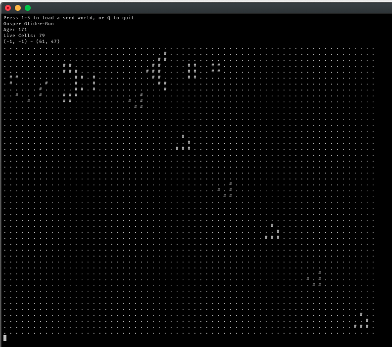

Here is my humble attempt to implement Conway’s Game of Life in declarative(ish) C#.  My aims were:

* To practice Discovery Testing for test-driven architecture
* To support infinite space
* To be as declarative as possible

You can follow my git history to see my progression of thought.

